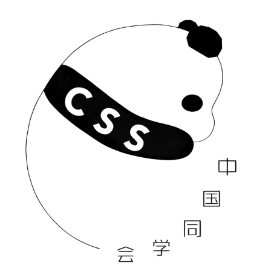

<div  style="display:flex;align-items:center;justify-content:center;margin-bottom:30px;">
  
</div>

# University of Calgary Chinese Students' Society

Established in 1968, the Chinese Students' Society (CSS) is the pioneering and largest Chinese student club at the University of Calgary. As a non-profit organization, CSS is devoted to promoting Chinese culture while fostering multiculturalism within the club.

We provide a welcoming environment for students to forge new friendships and broaden their social network through a variety of events, including our annual meet and greet, volunteer activities, dances, inter-club sports events, and year-end banquet.

## Overview

Visit the website: https://ucalgarycss.com/

Website for University of Calgary's Chinese Students' Society.

Netlify deployment status: [](https://app.netlify.com/sites/ucalgarycss/deploys)

## Technologies used

- Framework: 
- Languages:   
- UI Libraries:  
- Deployment: 

## Running locally

```bash
git clone https://github.com/allennguyen01/ucalgary-css.git
cd ucalgary-css
npm install  # or yarn if you prefer to use it instead :)
npm run build
npm run dev
```
